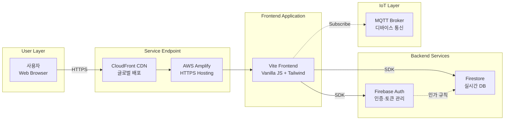
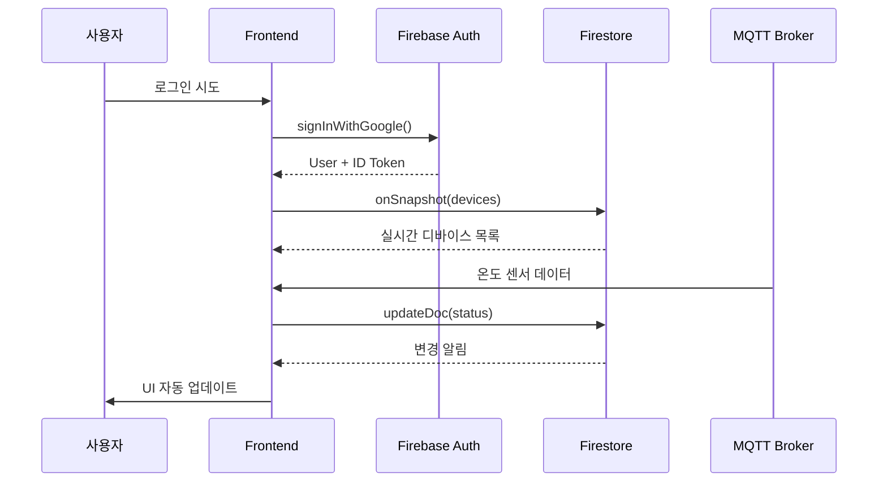

# 2.0 아키텍처.md

## 🎯 아키텍처 철학

**"강력한 상용 서비스의 조합으로 백엔드 없이 완성하는 MVP"**

Firebase와 AWS의 관리형 서비스를 전략적으로 조합하여, 백엔드 개발 부담 없이 프론트엔드 서비스 개발에 집중합니다. 인프라 운영·확장성·보안을 클라우드 제공자에게 위임하고, 비즈니스 로직과 사용자 경험 구현에 역량을 집중하는 설계 전략입니다.

---

## 📋 문제 정의

**상황**: AIoT 서비스 플랫폼 MVP 1단계 개발  
**제약**: 적은 인력, 빠른 출시 필요  
**목표**: 사용자가 IoT 디바이스를 등록·모니터링·제어할 수 있는 실시간 시각화 플랫폼

**핵심 요구사항**:
- 사용자 인증 및 데이터 격리
- 실시간 디바이스 상태 동기화
- MQTT 메시지 수신·시각화
- 글로벌 배포 및 자동 확장

---

## 🏛️ 아키텍처 개요

### **Serverless-First 전략**
백엔드 서버 구축 없이 Firebase + AWS 관리형 서비스로 완전한 IoT 플랫폼 구성

```
사용자 경험 계층 → 인증 계층 → 데이터 계층 → 통신 계층
   (Frontend)   (Firebase Auth) (Firestore)  (MQTT Broker)
```

**설계 원칙**:
- ✅ **관리형 우선**: 운영 부담 최소화
- ✅ **실시간성**: 디바이스 상태 즉시 반영
- ✅ **보안 내재화**: 인증·인가 규칙 기반 접근 제어
- ✅ **점진적 확장**: Phase 2 백엔드 추가 가능 구조

---

## 🔧 기술 스택

### **핵심 기술 스택**

| 계층 | 기술 | 역할 | 선택 이유 |
|------|------|------|-----------|
| **호스팅** | AWS Amplify | 정적 사이트 배포·CDN | Git 연동 자동 배포, SSL 기본 제공 |
| **인증** | Firebase Auth | 사용자 인증 관리 | Email/Google OAuth 즉시 사용, 토큰 자동 관리 |
| **데이터베이스** | Firestore | NoSQL 실시간 DB | 실시간 동기화, 자동 확장, 사용자별 데이터 격리 |
| **Frontend** | Vite + Vanilla JS | 빌드 도구·UI | 빠른 개발 서버, 가벼운 번들 |
| **스타일** | Tailwind CSS | 유틸리티 CSS | 빠른 UI 구성, 일관된 디자인 |

### **기술 선택 강점**

**Firebase Auth**
- 주요 OAuth 제공자 내장 (Google, GitHub 등)
- ID 토큰 자동 생성·갱신
- 클라이언트 SDK로 인증 상태 실시간 감지
- 백엔드 없이 보안 규칙으로 접근 제어

**Firestore**
- onSnapshot으로 실시간 동기화
- 오프라인 캐싱 자동 처리
- 사용자별 데이터 격리 규칙 작성 가능
- 쿼리·인덱싱 자동 최적화

**AWS Amplify**
- Git Push 시 자동 빌드·배포
- CloudFront CDN 통합
- 환경 변수 관리
- 무료 SSL 인증서

---

## 🌐 플랫폼 디자인

### **시스템 아키텍처**



### **데이터 플로우**



---

## 📡 API 명세서

### **Firebase Auth API**

```javascript
// 로그인
signInWithEmailAndPassword(email, password)
signInWithPopup(GoogleAuthProvider)

// 토큰 관리
await user.getIdToken() // 자동 갱신
onIdTokenChanged(callback) // 토큰 변경 감지

// 로그아웃
signOut()
```

### **Firestore API**

```javascript
// 실시간 구독
const unsubscribe = onSnapshot(
  query(collection(db, 'devices'), where('userId', '==', uid)),
  (snapshot) => {
    snapshot.docChanges().forEach(change => {
      if (change.type === 'added') { /* 신규 디바이스 */ }
      if (change.type === 'modified') { /* 상태 변경 */ }
    });
  }
);

// 단일 작업
await addDoc(collection(db, 'devices'), deviceData);
await updateDoc(doc(db, 'devices', id), { status: 'offline' });
await deleteDoc(doc(db, 'devices', id));
```

### **보안 규칙**

```javascript
// Firestore Security Rules
rules_version = '2';
service cloud.firestore {
  match /databases/{database}/documents {
    match /devices/{deviceId} {
      // 본인 디바이스만 접근
      allow read, write: if request.auth != null 
        && request.auth.uid == resource.data.userId;
    }
  }
}
```

---

## ⚙️ 환경 구성 가이드

### **1. Firebase 프로젝트 설정**

```bash
# Firebase Console에서 수행
1. 프로젝트 생성
2. Authentication 활성화
   - 이메일/비밀번호 활성화
   - Google OAuth 활성화
   - 승인된 도메인 추가: localhost, *.amplifyapp.com
3. Firestore Database 생성 (기본 모드)
4. 웹 앱 등록 → 구성 객체 복사
```

### **2. 로컬 환경 설정**

```bash
# 프로젝트 클론
git clone <repository-url>
cd aiot-device-manager-fe-working

# 의존성 설치
npm install

# 환경 변수 설정
cp .env.example .env
```

**.env 파일**
```bash
VITE_FIREBASE_API_KEY=your-api-key
VITE_FIREBASE_AUTH_DOMAIN=your-project.firebaseapp.com
VITE_FIREBASE_PROJECT_ID=your-project-id
VITE_FIREBASE_STORAGE_BUCKET=your-project.appspot.com
VITE_FIREBASE_MESSAGING_SENDER_ID=123456789
VITE_FIREBASE_APP_ID=1:123456789:web:abcdef
```

### **3. 개발 서버 실행**

```bash
npm run dev
# http://localhost:5173 접속
```

---

## 🚀 배포·운영 가이드

### **AWS Amplify 배포**

**1단계: Git 연결**
```bash
# Amplify Console에서 수행
1. New App → Host web app
2. GitHub/GitLab 저장소 연결
3. 브랜치 선택 (main)
```

**2단계: 빌드 설정 (amplify.yml)**
```yaml
version: 1
frontend:
  phases:
    preBuild:
      commands:
        - npm ci
    build:
      commands:
        - npm run build
  artifacts:
    baseDirectory: dist
    files:
      - '**/*'
  cache:
    paths:
      - node_modules/**/*
```

**3단계: 환경 변수 주입**
```bash
# Amplify Console → Environment variables
VITE_FIREBASE_API_KEY = <Firebase 값>
VITE_FIREBASE_AUTH_DOMAIN = <Firebase 값>
...
```

**4단계: 배포 완료**
- Git Push 시 자동 빌드·배포
- 배포 URL: `https://<branch>.<app-id>.amplifyapp.com`
- Firebase 승인된 도메인에 Amplify URL 추가

### **모니터링**

**Firebase Console**
- Authentication → 사용자 활동 추적
- Firestore → 데이터 읽기/쓰기 통계
- Usage → 비용 모니터링

**Amplify Console**
- Monitoring → 빌드 히스토리
- 트래픽 통계
- 에러 로그

### **확장 시나리오 (Phase 2)**

```
현재 구조에 백엔드 추가 시:

사용자 → Amplify → Frontend
              ↓
          Firebase Auth (인증 유지)
              ↓
          Backend API (NestJS/Express)
              ↓
          PostgreSQL/MySQL (관계형 데이터)
              ↓
          Firestore (실시간 데이터만 유지)
```

**추가 가능 기능**:
- 복잡한 데이터 분석 (SQL)
- 외부 API 연동 (ERP, 이메일)
- 서버 사이드 비즈니스 로직
- 감사 로그 영구 저장

---

## 🎓 핵심 키워드

**확장 학습 주제**:
- `Firebase Security Rules` → 고급 접근 제어
- `Firestore Indexes` → 쿼리 최적화
- `MQTT over WebSocket` → 실시간 통신
- `Vite Plugin Ecosystem` → 빌드 최적화
- `CloudFront Cache Invalidation` → CDN 관리
- `Firebase Extensions` → 서버리스 함수 추가

**운영 관점**:
- 사용량 기반 과금 모니터링
- Firestore 읽기/쓰기 최적화
- 인증 토큰 만료 전략
- 오프라인 동기화 처리