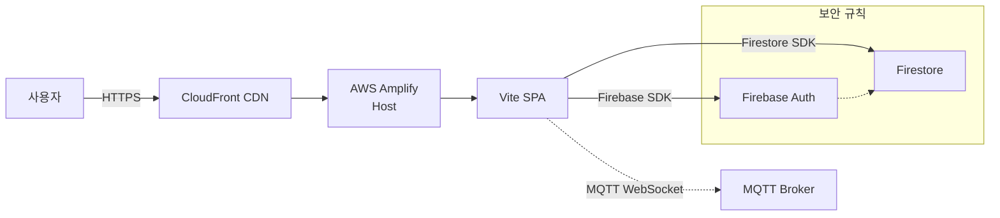
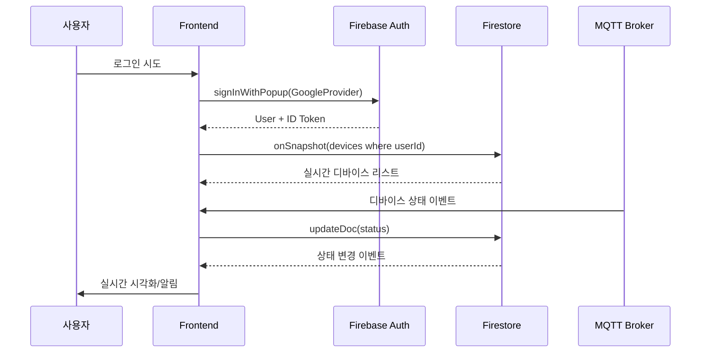

# 2.0 아키텍처

## 📝 서두말
상용 서비스로 검증된 Firebase · AWS의 매니지드 기능을 조합하여, 백엔드 인프라를 직접 운영하지 않고 프론트엔드 개발에만 집중하는 것이 이 아키텍처의 핵심 철학입니다. 사용자 경험과 실시간 시각화에 집중하는 팀은 인프라·보안·배포를 클라우드 서비스에 위임하고, 확장 가능한 MVP를 빠르게 완성할 수 있습니다.

## 📋 문제 정의
- **상황**: AIoT 서비스 플랫폼 MVP 1단계 개발, 실시간 디바이스 제어를 구현해야 함  
- **제약**: 소규모 팀, 짧은 개발 주기, 백엔드 운영 경험이 제한적  
- **목표**: 사용자가 디바이스를 등록·모니터링·제어할 수 있는 실시간 시각화 플랫폼 표현  
- **핵심 포커스**: 관리형 Auth/DB/호스팅 · SDK 중심 FE · 보안 규칙 기반 데이터 격리로 최소 인프라로 최대 퍼포먼스 확보

## 🏗️ 아키텍처 개요
1. **FE 중심 흐름**: Vite + Tailwind 기반 SPA가 모든 UI/UX 로직을 책임지고, SDK 호출만으로 통신·인증·데이터를 처리합니다.  
2. **Serverless-first 설계**: Firebase Auth → Firestore 실시간 DB → Amplify 정적 호스팅 흐름만으로 CRUD/실시간 동기화 달성.  
3. **보안과 격리**: Firebase Security Rules에 사용자별 접근 제어를 정의하고, 인증된 토큰만 Firestore 문서에 접근 가능.
4. **확장성**: Phase 2 시점에 NestJS/Express와 같은 백엔드 API를 Firebase Auth 토큰으로 보호하여 기존 FE 구조를 그대로 재사용할 수 있도록 설계했습니다.

## 🧰 기술 스택

| 계층 | 선택 기술 | 역할 | 강점 |
|---|---|---|---|
| Authentication | Firebase Auth | 사용자 로그인, ID 토큰 발급 | OAuth 통합, 클라이언트 SDK 기반 상태 관리, 보안 규칙과 연계 |
| Database | Firestore | NoSQL 실시간 데이터 스토어 | onSnapshot 실시간, offline cache, 자동 확장, 사용자 단위 보안 규칙 |
| Hosting | AWS Amplify | Git 기반 빌드 · CDN 배포 | git push 자동 배포, CloudFront + SSL, 환경변수 관리 |
| Frontend | Vite + Vanilla JS/Vue | 빠른 개발/빌드 | HMR, 경량 번들, TypeScript 연동 용이 |
| Styling | Tailwind CSS | 유틸리티 중심 UI | 일관된 디자인, 작은 클래스 조합만으로 유연한 UI 구성 |

### 핵심 기술별 간결한 이유
- **Firebase Auth**: OAuth, Email 로그인과 토큰이 통합되어 있어 백엔드 없이도 인증·인가 구현이 가능. |  
- **Firestore**: 읽기/쓰기 이벤트를 자동 스트리밍, `where('userId','==',uid)` 쿼리로 사용자 단위 정보 격리 가능.  
- **AWS Amplify**: Amplify Console이 Git 브랜치를 빌드하고 정적 자산(HTTPS+CDN)을 전 세계에 배포.  
- **Vite/Tailwind**: 빠른 개발서버와 일관된 스타일 체계로 실습자가 즉시 UI를 확장 가능.

## 💡 플랫폼 디자인

### 사용자 관점 서비스 흐름


예시 키워드 흐름: `사용자 → 서비스 Endpoint [FE → Amplify → Firebase Auth → Firestore]`

### 시퀀스 흐름 (등록·모니터링)


## 🔐 API 명세서

### Authentication (Firebase Auth SDK)
```javascript
signInWithEmailAndPassword(email, password)
signInWithPopup(new GoogleAuthProvider())
signOut()
const token = await user.getIdToken()
onIdTokenChanged((user) => { /* Token refresh */ })
```

### Firestore (실시간 구독 중심)
```javascript
const deviceQuery = query(collection(db, 'devices'), where('userId', '==', uid));
const unsubscribe = onSnapshot(deviceQuery, (snapshot) => {
  snapshot.docChanges().forEach(change => { /* added/modified -> refresh UI */ });
});

await addDoc(collection(db, 'devices'), deviceData);
await updateDoc(doc(db, 'devices', deviceId), { status: 'online' });
await deleteDoc(doc(db, 'devices', deviceId));
```

### 보안 규칙 (Firestore)
```javascript
rules_version = '2';
service cloud.firestore {
  match /databases/{database}/documents {
    match /devices/{deviceId} {
      allow read, write: if request.auth != null
        && request.auth.uid == resource.data.userId;
    }
  }
}
```

## ⚙️ 환경 구성 가이드

1. **Firebase 준비**
   - 프로젝트 생성 → Authentication (Email + Google OAuth) → Firestore 생성
   - 승인된 도메인에 `localhost`, `*.amplifyapp.com` 추가 → 웹 앱 등록 → config 확보
2. **환경 변수**
   ```bash
   cp .env.example .env
   VITE_FIREBASE_API_KEY=…
   VITE_FIREBASE_AUTH_DOMAIN=…
   VITE_FIREBASE_PROJECT_ID=…
   ```
3. **로컬 실행**
   ```bash
   npm install
   npm run dev  # http://localhost:5173
   ```
4. **실습 팁**
   - Firebase Emulator Suite로 로컬 Firestore/Auth 테스트
   - `onSnapshot` 콜백에 Loading/empty 상태 처리 추가

## 🚀 배포·운영 가이드

### AWS Amplify 배포
1. Amplify Console → Host web app → GitHub/GitLab 연결 → main 브랜치 선택  
2. `amplify.yml` 설정
   ```yaml
   version: 1
   frontend:
     phases:
       preBuild:
         commands:
           - npm ci
       build:
         commands:
           - npm run build
     artifacts:
       baseDirectory: dist
       files:
         - '**/*'
     cache:
       paths:
         - node_modules/**/*
   ```
3. Amplify 환경 변수에 Firebase config 주입 → `VITE_FIREBASE_*` 설정
4. Git Push 시 자동 빌드·배포 → Amplify URL을 Firebase 승인 도메인에 추가

### 운영 모니터링
- Firebase Console: Authentication 사용자 활동, Firestore 읽기/쓰기 사용량 → 과금 경고 설정  
- Amplify Console: 빌드 성공/실패 + 트래픽/지연 모니터링, 배포 URL health 체크

### Phase 2 확장 시나리오 (백엔드 추가)
```text
사용자 → Amplify → Frontend
                  ↓
              Firebase Auth (토큰 validation)
                  ↓
              Backend API (NestJS / Express)
                  ↓
              PostgreSQL / MySQL (관계형)
                  ↓
              Firestore (실시간 상태)
```
- Backend API는 Firebase Admin SDK로 토큰 검증 → Firestore는 실시간 뷰, 중요 데이터는 관계형 DB로 이관  
- Batch 처리, 외부 API 연동(ERP, 알림), 감사 로그 저장 등을 새로운 서비스 계층에서 실행

## 🔑 핵심 키워드
- `Firebase Security Rules` → 사용자별 데이터 격리 및 Firebase RBAC  
- `Firestore onSnapshot` → 실시간 스트림 + 상태 관리 전략  
- `MQTT over WebSocket` → 공통 MQTT 브로커를 통한 센서 데이터 파이프라인  
- `Vite Plugin Ecosystem` → 생산성 향상 및 PWA/SSR 확장  
- `CloudFront Cache Invalidation` → CDN 캐싱 전략 및 배포 롤백  
- `Amplify Environment Variables` → stage별 Firebase config 분리  
- `Phase 2 Backend` → 토큰 기반 API 게이트웨이 및 관계형 DB 연동  
- `Observability` → Firebase/Amplify 모니터링과 비용 알림
