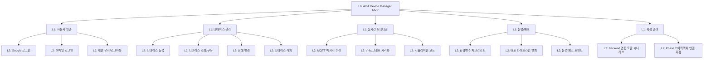

# FBS (Function Breakdown Structure) - AIoT 서비스 플랫폼

## 문서 목적
이 문서는 서비스가 제공해야 할 기능을 계층적으로 분해하여, 비기술 이해관계자도 “무엇을 만들고 검증해야 하는지”를 빠르게 이해하도록 돕습니다.  
개발/테스트/강의 실습 범위를 기능 단위로 정렬하는 기준 문서입니다.

## 문서 정보
| 항목 | 값 |
|---|---|
| 문서 ID | PLAT-FBS-001 |
| 버전 | v1.0 |
| 작성일 | 2026-03-15 |
| 최종 수정일 | 2026-03-15 |
| 작성자 | Ryan9Kim / Codex |
| 승인자 | TBD |
| 상태 | Draft (강의 산출물 v1) |

## 1. 기능 분해 기준
- Level 0: 서비스 목적
- Level 1: 핵심 기능 영역
- Level 2: 구현/검증 가능한 세부 기능

## 2. 기능 트리

## 3. 기능 목록 상세
| 기능 ID | 기능명 | 설명 | 우선순위 | 완료 기준(요약) |
|---|---|---|---|---|
| F-A1 | Google 로그인 | Firebase Auth 기반 소셜 로그인 | High | 로그인 성공 후 사용자 상태 반영 |
| F-A2 | 이메일 로그인 | 이메일/비밀번호 로그인 | High | 유효 계정 로그인 및 오류 처리 |
| F-A3 | 세션 유지 | 로그인 상태 유지 및 로그아웃 | High | 재접속 시 세션 복원/종료 가능 |
| F-B1 | 디바이스 등록 | 사용자별 디바이스 생성 | High | 등록 후 목록에 즉시 노출 |
| F-B2 | 디바이스 조회/구독 | Firestore 기반 목록 반영 | High | 상태 변경 시 화면 갱신 |
| F-B3 | 상태 변경 | 온라인/경고/오프라인 변경 | Medium | 상태 전환 시 카드 표시 반영 |
| F-B4 | 디바이스 삭제 | 디바이스 제거 | Medium | 삭제 후 목록에서 제거 |
| F-C1 | MQTT 수신 | 토픽 메시지 수신 처리 | High | 메시지 수신 로그/상태 반영 |
| F-C2 | 시각화 | 카드/그래프로 상태 표현 | Medium | 선택 디바이스 지표 시각화 |
| F-C3 | 시뮬레이션 | 브로커 미연결 시 대체 동작 | High | 실습 환경에서도 기능 시연 가능 |
| F-D1 | 환경 체크 | Firebase 설정/권한 점검 | High | 체크리스트 상태 표시 |
| F-D2 | 배포 연계 | Amplify 배포 흐름 반영 | Medium | 배포 후 기본 기능 동작 |
| F-D3 | 운영 포인트 | 인증/데이터 오류 대응 기준 | Medium | 운영 체크 항목 문서화 |
| F-E1 | BE 연동 시나리오 | 2단계 확장 흐름 안내 | Medium | 확장 방향 문서에 반영 |
| F-E2 | 확장 연결 지점 | API/SQL 확장 포인트 정의 | Medium | 아키텍처 문서에 추적 가능 |

## 4. 기능 간 의존관계
- 인증(F-A1~A3)이 완료되어야 사용자별 디바이스 기능(F-B*)이 정상 동작한다.
- 디바이스 기능(F-B*)은 실시간 모니터링(F-C*)의 데이터 소스가 된다.
- 운영/배포(F-D*)는 모든 기능의 실행 안정성을 보장한다.
- 확장 준비(F-E*)는 MVP 완성 이후 단계로, 현재 기능을 침범하지 않고 연결해야 한다.

## 5. 추적성 규칙
- FBS 기능 ID(`F-*`)는 `SRS` 요구사항 ID(`REQ-*`)와 1:N으로 매핑한다.
- 아키텍처 설계문서에서는 기능 그룹 단위(A/B/C/D/E)로 컴포넌트/데이터 흐름을 연결한다.

## 변경 이력
| 버전 | 일자 | 작성자 | 변경 내용 | 승인 |
|---|---|---|---|---|
| v1.0 | 2026-03-15 | Ryan9Kim / Codex | 초기 작성 | - |
