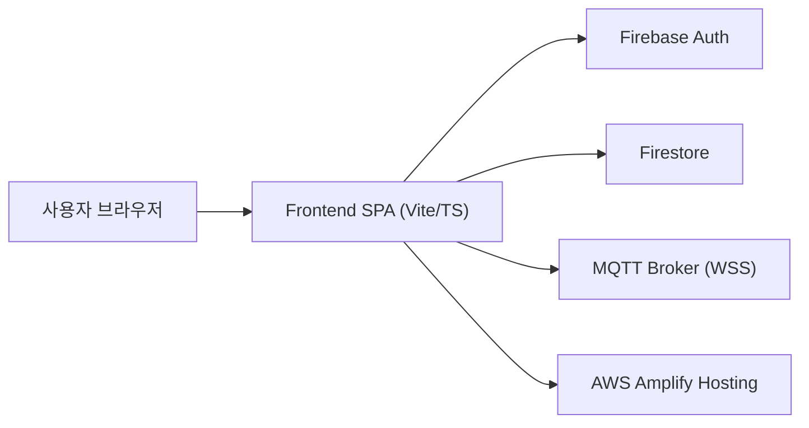
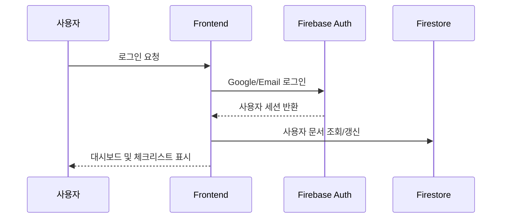
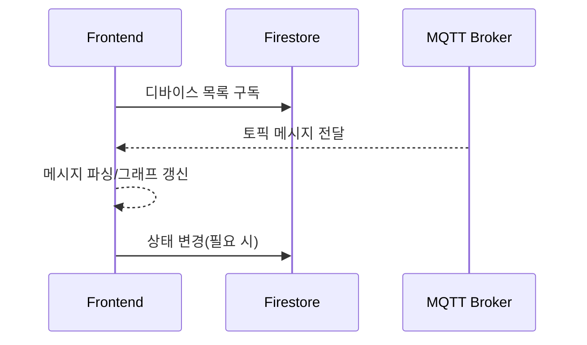
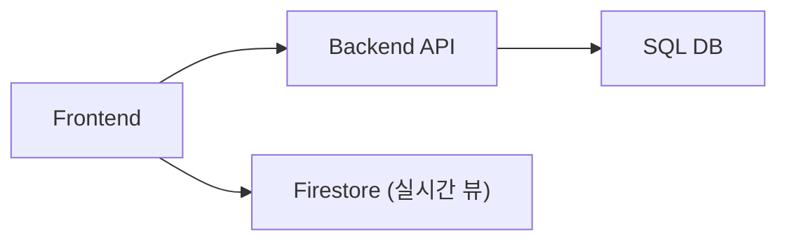

# 아키텍처 설계문서 - AIoT Device Manager

## 문서 목적
이 문서는 시스템을 어떤 구조로 설계했고, 왜 그렇게 설계했는지를 이해관계자에게 명확히 설명하기 위한 문서입니다.  
개발자에게는 구현 기준, 비개발자에게는 시스템 동작 원리를 제공하는 공통 참조 문서입니다.

## 문서 정보
| 항목 | 값 |
|---|---|
| 문서 ID | PLAT-ARCH-001 |
| 버전 | v1.0 |
| 작성일 | 2026-03-15 |
| 최종 수정일 | 2026-03-15 |
| 작성자 | Ryan9Kim / Codex |
| 승인자 | TBD |
| 상태 | Draft (강의 산출물 v1) |

## 1. 설계 범위
- 대상: AIoT Device Manager 교육용 MVP(Phase 1 중심)
- 설계 관점: 인증, 데이터, 실시간 모니터링, 배포, 확장성
- 기준: 현재 리포지토리 `main` 브랜치 코드 구조

## 2. 설계 목표 및 원칙
### 2.1 설계 목표
- 짧은 시간 내 실습 가능한 구조
- 문서와 코드의 대응이 쉬운 구조
- Phase 2 백엔드 확장에 대비한 구조

### 2.2 설계 원칙
- Managed 서비스 우선(Firebase/AWS)으로 초기 복잡도 축소
- 기능 모듈 단위 분리로 학습/유지보수 용이성 확보
- 인증 상태를 중심으로 데이터 접근 제어

## 3. 전체 아키텍처

## 4. 컴포넌트 설계
### 4.1 Frontend 주요 모듈
- `features/auth`: 로그인/로그아웃, 세션 관리
- `features/device-management`: 디바이스 CRUD 및 목록 구독
- `features/mqtt-monitoring`: MQTT 연결/메시지 처리/시뮬레이션
- `pages/home`: 체크리스트, 기능 타일, 통합 대시보드
- `app/providers`: Firebase App/Auth/Firestore 초기화

### 4.2 데이터 접근
- 인증 사용자 기준으로 사용자별 디바이스 컬렉션 접근
- Firestore 실패 시 학습 지속을 위한 fallback 동작 제공

## 5. 런타임 주요 시나리오
### 5.1 로그인 및 초기화

### 5.2 디바이스 모니터링

## 6. 데이터 설계(요약)
### 6.1 핵심 엔티티
- User
  - `uid`, `email`, `displayName`, `provider`, `lastLoginAt`
- Device
  - `id`, `name`, `status`, `location`, `topicPath`, `lastSeen`
- Telemetry(표시용)
  - `topic`, `payload`, `receivedAt`

### 6.2 저장소
- Phase 1: Firestore 중심(실시간 구독)
- Phase 2: Backend + SQL 저장소 확장 가능 구조

## 7. 보안 설계(요약)
- 인증: Firebase Auth
- 접근 제어: 인증 상태 기반 데이터 접근
- 운영 체크: 승인 도메인, 권한, 환경변수 점검

## 8. 배포 설계(요약)
- Frontend: AWS Amplify
- 구성값: `VITE_*` 환경변수 주입
- 운영 포인트:
  - Firebase 승인 도메인 등록
  - Firestore 규칙 검증
  - MQTT 브로커 연결 상태 확인

## 9. Phase 2 확장 설계
### 9.1 확장 목적
- 실시간 이벤트를 백엔드 API와 SQL에 축적해 분석/운영 고도화

### 9.2 확장 구조

### 9.3 확장 시 고려사항
- 토큰 검증/권한 모델 통합
- 이벤트 저장 전략(append-only, 보존주기)
- 관찰성(로그/메트릭/알람) 도입

## 10. 설계 검증 체크리스트
- [ ] 기능 요구사항(SRS)과 컴포넌트가 1회 이상 매핑되는가
- [ ] 인증/데이터/실시간 흐름이 시퀀스 다이어그램으로 설명 가능한가
- [ ] 운영자가 배포/환경 오류를 체크리스트로 진단 가능한가
- [ ] 확장(Phase 2) 시 현재 구조를 크게 깨지 않고 연결 가능한가

## 변경 이력
| 버전 | 일자 | 작성자 | 변경 내용 | 승인 |
|---|---|---|---|---|
| v1.0 | 2026-03-15 | Ryan9Kim / Codex | 초기 작성 | - |
