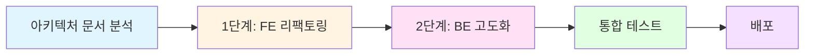

# 📌 2.0 리팩토링 워크플로우

> **프로젝트 목표**: Phase 1 Serverless MVP → Phase 2 하이브리드 아키텍처 구현
> **작업 방식**: 테스트 주도 개발(TDD) + 모던 디자인 패턴 적용
> **작업 기록**: 모든 주요 의사결정과 프롬프트는 `working-history.md`에 일시 포함하여 기록

---

## 🎯 전체 작업 흐름



---

## 📋 필수 사전 작업

### ✅ 체크리스트

- [ ] `docs/(1.3) 📌 2.0 아키텍처 종합.md` 문서 정독 완료
- [ ] 현재 디렉토리 구조 확인
  - `aiot-dvc-mgr-fe-2.0-refactoring/` 존재 확인
  - `aiot-dvc-mgr-be-2.0-refactoring/` 존재 확인
- [ ] working-history.md 파일 준비 완료

---

## 1️⃣ 단계: 프론트엔드 리팩토링

### 📂 작업 디렉토리
```
aiot-dvc-mgr-fe-2.0-refactoring/
```

### 🎨 디자인 패턴 선정

#### Option 1: **FSD (Feature-Sliced Design)** ⭐ 추천
```
src/
├── app/                    # 앱 초기화, 프로바이더
├── pages/                  # 라우트별 페이지
├── widgets/                # 독립적인 UI 블록
├── features/               # 사용자 시나리오별 기능
├── entities/               # 비즈니스 엔티티
├── shared/                 # 공통 유틸/UI
└── processes/              # 복잡한 비즈니스 프로세스
```

**선택 이유**:
- IoT 디바이스 관리라는 명확한 도메인
- 디바이스, 센서, 사용자 등 엔티티 분리 용이
- 기능별 독립성 확보 → 테스트 용이

#### Option 2: Clean Architecture (Layered)
```
src/
├── presentation/           # UI 컴포넌트
├── application/            # 유스케이스, 서비스
├── domain/                 # 비즈니스 로직
└── infrastructure/         # Firebase, MQTT 연동
```

**선택 이유**:
- 의존성 역전 원칙 준수
- Firebase/MQTT를 교체 가능한 어댑터로 설계

---

### 🔨 작업 단계

#### Step 1: 아키텍처 결정 (30분)
```bash
# 1. 디자인 패턴 최종 결정
- FSD vs Clean Architecture 검토
- 팀과 협의 후 결정

# 2. working-history.md 기록
```

**기록 예시**:
```markdown
## 2025-01-03 14:30 - 디자인 패턴 선정

**사용자 요청**: FSD 패턴 또는 더 나은 패턴 제안
**Claude 제안**: FSD (Feature-Sliced Design)
**선택 이유**:
1. IoT 도메인에 적합한 엔티티 분리
2. Firebase 의존성 격리 용이
3. 테스트 가능한 구조

**최종 결정**: FSD 패턴 적용
```

#### Step 2: 프로젝트 초기화 (1시간)
```bash
cd aiot-dvc-mgr-fe-2.0-refactoring

# 1. Vite 프로젝트 생성
npm create vite@latest . -- --template vanilla-ts

# 2. 필수 패키지 설치
npm install firebase@^10.8.0
npm install -D tailwindcss postcss autoprefixer
npm install -D vitest @vitest/ui jsdom
npm install -D @testing-library/dom @testing-library/user-event

# 3. Tailwind 초기화
npx tailwindcss init -p
```

**기록 사항**:
- 프로젝트 초기화 명령어
- 패키지 버전
- 설정 파일 내용

#### Step 3: 디렉토리 구조 구성 (30분)

**FSD 적용 시**:
```bash
mkdir -p src/{app,pages,widgets,features,entities,shared}
mkdir -p src/app/{providers,styles}
mkdir -p src/features/{auth,device-management,mqtt-monitoring}
mkdir -p src/entities/{device,user,sensor}
mkdir -p src/shared/{ui,lib,api,config}
```

#### Step 4: TDD 기반 핵심 기능 구현 (8시간)

**우선순위 순서**:

1. **Firebase Auth 연동** (2시간)
   ```bash
   # 1. 테스트 작성
   touch src/features/auth/__tests__/auth.test.ts

   # 2. 테스트 실행 (실패 확인)
   npm run test

   # 3. 구현
   touch src/features/auth/model/auth-service.ts

   # 4. 테스트 통과 확인
   ```

2. **Firestore 실시간 구독** (2시간)
   ```bash
   touch src/entities/device/__tests__/device-repository.test.ts
   touch src/entities/device/api/device-repository.ts
   ```

3. **디바이스 CRUD** (2시간)
   ```bash
   touch src/features/device-management/__tests__/device-crud.test.ts
   touch src/features/device-management/model/device-service.ts
   ```

4. **MQTT 메시지 수신** (2시간)
   ```bash
   touch src/features/mqtt-monitoring/__tests__/mqtt-client.test.ts
   touch src/features/mqtt-monitoring/model/mqtt-client.ts
   ```

#### Step 5: UI 컴포넌트 개발 (4시간)

**Shared UI 컴포넌트**:
```bash
# Button, Input, Card 등 공통 컴포넌트
touch src/shared/ui/{button,input,card}/index.ts
```

**Feature별 UI**:
```bash
# Auth UI
touch src/features/auth/ui/{login-form,google-auth-button}.ts

# Device Management UI
touch src/features/device-management/ui/{device-list,device-form,device-card}.ts
```

#### Step 6: 통합 및 테스트 (2시간)

```bash
# E2E 테스트 작성
touch tests/e2e/{auth,device-crud,realtime-sync}.test.ts

# 전체 테스트 실행
npm run test
npm run test:e2e
```

---

### 📝 작업 기록 규칙

**working-history.md 기록 형식**:

```markdown
## YYYY-MM-DD HH:MM - [작업 제목]

**컨텍스트**:
현재 작업 배경 및 문제점

**사용자 프롬프트**:
> "실제 사용자가 요청한 내용"

**Claude 응답**:
- 제안 1
- 제안 2
- 최종 선택 및 이유

**결정 사항**:
- [ ] 결정 항목 1
- [ ] 결정 항목 2

**구현 코드** (선택):
\`\`\`typescript
// 핵심 코드 스니펫
\`\`\`

**다음 단계**:
1. 다음 작업
2. 검증 사항

---
```

---

### ✅ 1단계 완료 체크리스트

- [ ] 디자인 패턴 결정 및 문서화
- [ ] 프로젝트 초기화 완료
- [ ] 디렉토리 구조 구성 완료
- [ ] Firebase Auth 연동 (테스트 포함)
- [ ] Firestore 실시간 구독 (테스트 포함)
- [ ] 디바이스 CRUD (테스트 포함)
- [ ] MQTT 메시지 수신 (테스트 포함)
- [ ] UI 컴포넌트 개발 완료
- [ ] 전체 테스트 통과 (커버리지 80% 이상)
- [ ] working-history.md 모든 주요 결정 기록 완료

---

## 2️⃣ 단계: 백엔드 고도화

### 📂 작업 디렉토리
```
aiot-dvc-mgr-be-2.0-refactoring/
```

### 🏗️ 아키텍처 패턴 선정

#### **Clean Architecture + DDD** ⭐ 추천
```
src/
├── application/            # 유스케이스, DTO
│   ├── use-cases/
│   └── dtos/
├── domain/                 # 엔티티, 리포지토리 인터페이스
│   ├── entities/
│   ├── repositories/
│   └── services/
├── infrastructure/         # 구현체 (Firebase, MySQL)
│   ├── firebase/
│   ├── database/
│   └── mqtt/
└── presentation/           # API 라우터, 컨트롤러
    ├── controllers/
    ├── middlewares/
    └── validators/
```

---

### 🔨 작업 단계

#### Step 1: 프로젝트 초기화 (1시간)
```bash
cd aiot-dvc-mgr-be-2.0-refactoring

# 1. TypeScript Node 프로젝트 초기화
npm init -y
npm install express@^4.19.2 cors@^2.8.5 dotenv@^16.4.5
npm install firebase-admin@^12.5.0 mysql2@^3.9.4
npm install pino@^9.4.0 pino-pretty@^11.2.1 zod@^3.23.8

# 2. 개발 의존성
npm install -D typescript@^5.4.5 @types/node@^20.11.30
npm install -D @types/express@^4.17.21 @types/cors
npm install -D tsx@^4.7.1 vitest@latest

# 3. TypeScript 설정
npx tsc --init
```

#### Step 2: 디렉토리 구조 구성 (30분)
```bash
mkdir -p src/{application,domain,infrastructure,presentation}
mkdir -p src/application/{use-cases,dtos}
mkdir -p src/domain/{entities,repositories,services}
mkdir -p src/infrastructure/{firebase,database,mqtt}
mkdir -p src/presentation/{controllers,middlewares,validators}
mkdir -p tests/{unit,integration}
```

#### Step 3: TDD 기반 핵심 기능 구현 (10시간)

**우선순위 순서**:

1. **Firebase Admin 토큰 검증** (2시간)
   ```bash
   touch tests/unit/firebase-auth.test.ts
   touch src/infrastructure/firebase/firebase-auth.service.ts
   ```

2. **MySQL 연결 및 스키마** (2시간)
   ```bash
   touch db/schema.sql
   touch src/infrastructure/database/pool.ts
   touch tests/integration/database.test.ts
   ```

3. **센서 데이터 저장 유스케이스** (2시간)
   ```bash
   touch tests/unit/save-sensor-data.test.ts
   touch src/application/use-cases/save-sensor-data.use-case.ts
   ```

4. **API 엔드포인트 구현** (2시간)
   ```bash
   touch tests/integration/sensor-routes.test.ts
   touch src/presentation/controllers/sensor.controller.ts
   touch src/presentation/routes/sensor.routes.ts
   ```

5. **미들웨어 및 검증** (2시간)
   ```bash
   touch tests/unit/firebase-auth.middleware.test.ts
   touch src/presentation/middlewares/firebase-auth.middleware.ts
   touch src/presentation/validators/sensor-data.validator.ts
   ```

#### Step 4: Docker 환경 구성 (1시간)
```bash
# docker-compose.yml 작성
touch docker-compose.yml

# MySQL 컨테이너 실행
docker compose up -d

# 스키마 적용 확인
npm run db:migrate
```

#### Step 5: 통합 테스트 (2시간)
```bash
# API 통합 테스트
npm run test:integration

# 커버리지 확인
npm run test:coverage
```

---

### ✅ 2단계 완료 체크리스트

- [ ] 아키텍처 패턴 결정 및 문서화
- [ ] 프로젝트 초기화 완료
- [ ] 디렉토리 구조 구성 완료
- [ ] Firebase Admin 토큰 검증 (테스트 포함)
- [ ] MySQL 연결 및 스키마 (테스트 포함)
- [ ] 센서 데이터 저장 유스케이스 (테스트 포함)
- [ ] API 엔드포인트 구현 (테스트 포함)
- [ ] 미들웨어 및 검증 로직 (테스트 포함)
- [ ] Docker 환경 구성 완료
- [ ] 전체 테스트 통과 (커버리지 80% 이상)
- [ ] working-history.md 모든 주요 결정 기록 완료

---

## 🔗 3단계: FE-BE 통합

### 작업 순서

1. **환경 변수 설정**
   ```bash
   # FE: .env
   VITE_BACKEND_BASE_URL=http://localhost:4000

   # BE: .env
   ALLOWED_ORIGINS=http://localhost:5173
   ```

2. **통합 테스트 시나리오**
   - [ ] FE에서 Google 로그인 → BE로 토큰 전송
   - [ ] FE에서 센서 데이터 전송 → BE MySQL 저장
   - [ ] MQTT 메시지 수신 → Firestore 업데이트 → FE 실시간 반영

3. **E2E 테스트 작성**
   ```bash
   touch tests/e2e/full-flow.test.ts
   ```

---

## 📊 작업 진행 상황 추적

### 진행률 체크

```
1단계: 프론트엔드 리팩토링
[░░░░░░░░░░] 0% (0/10 완료)

2단계: 백엔드 고도화
[░░░░░░░░░░] 0% (0/10 완료)

3단계: FE-BE 통합
[░░░░░░░░░░] 0% (0/3 완료)
```

### 일일 작업 로그

**작업 일지 형식** (`working-history.md`):
```markdown
# 작업 히스토리

## 2025-01-03 (금)

### 오전 작업
- [ ] 09:00-10:00: 아키텍처 문서 분석
- [ ] 10:00-12:00: FE 디자인 패턴 결정 및 프로젝트 초기화

### 오후 작업
- [ ] 13:00-15:00: Firebase Auth 연동 (TDD)
- [ ] 15:00-17:00: Firestore 실시간 구독 (TDD)

### 주요 의사결정
1. **디자인 패턴**: FSD 선택
   - 이유: 도메인 특성상 엔티티 분리 명확

2. **테스트 프레임워크**: Vitest
   - 이유: Vite와 네이티브 통합

---
```

---

## ⚠️ 주의사항

### 🚨 반드시 지켜야 할 규칙

1. **모든 코드는 테스트 먼저 작성** (TDD)
   - 테스트 없는 코드 커밋 금지
   - 최소 커버리지: 80%

2. **working-history.md 실시간 기록**
   - 주요 의사결정은 일시 포함
   - 사용자와 주고받은 프롬프트 원문 기록
   - 선택하지 않은 옵션도 기록 (이유 포함)

3. **디자인 패턴 일관성 유지**
   - 한 번 선택한 패턴은 전체 프로젝트에 적용
   - 예외 사항은 반드시 문서화

4. **Firebase 의존성 격리**
   - Infrastructure 레이어에만 Firebase 코드 허용
   - Domain/Application 레이어는 인터페이스만 의존

5. **환경 변수 보안**
   - `.env` 파일은 절대 커밋 금지
   - `.env.example` 만 커밋

---

## 🎯 성공 기준

### 1단계 성공 기준
- [ ] 모든 테스트 통과 (커버리지 80%+)
- [ ] Firebase Auth 정상 작동
- [ ] Firestore 실시간 동기화 작동
- [ ] MQTT 메시지 수신 작동
- [ ] Amplify 배포 성공

### 2단계 성공 기준
- [ ] 모든 테스트 통과 (커버리지 80%+)
- [ ] Firebase 토큰 검증 정상 작동
- [ ] MySQL 데이터 저장/조회 정상 작동
- [ ] API 엔드포인트 정상 응답
- [ ] Docker 환경 안정적 구동

### 전체 성공 기준
- [ ] FE-BE 통합 정상 작동
- [ ] E2E 테스트 통과
- [ ] 프로덕션 배포 완료
- [ ] working-history.md 완성도 90%+

---

## 📞 도움이 필요할 때

### Claude와 협업 시 프롬프트 예시

```
[1단계 작업 중]
"FSD 패턴에서 Firebase Auth 로직을 어느 레이어에 위치시켜야 할까요?
- entities/user?
- features/auth?
- shared/api?"

[2단계 작업 중]
"Clean Architecture에서 Firebase Admin SDK를
Infrastructure 레이어에 두는 것이 맞나요?
Domain 레이어는 어떻게 인터페이스를 정의해야 하나요?"

[테스트 작성 중]
"Firestore onSnapshot을 테스트하려면 어떻게 모킹해야 하나요?
Vitest에서 비동기 이벤트를 어떻게 검증하나요?"
```

---

## 📚 참고 문서

- `docs/(1.3) 📌 2.0 아키텍처 종합.md` - 전체 아키텍처 가이드
- `docs/CLOUD_DEPLOYMENT_GUIDE.md` - 배포 가이드
- `docs/SECURITY_REVIEW.md` - 보안 검토

---

**문서 작성일**: 2025-01-03
**최종 업데이트**: 작업 시작 전
**다음 검토**: 1단계 완료 후
